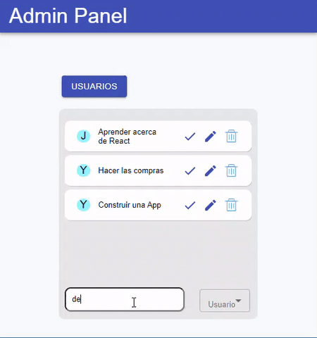

# Admin Panel Web

Project with ReactJs to add, edit and delete users and tasks.

## How to run this project?

In the project directory, you can run:

### `npm install`

This command installs all dependencies to run the proyect.

### `npm start`

Runs the app in the development mode. 
Open [http://localhost:3000](http://localhost:3000) to view it in the browser.

The page will reload if you make edits. 

